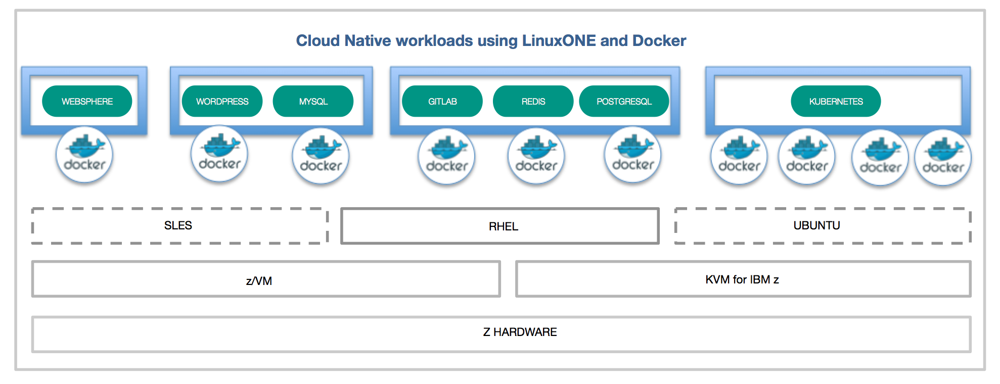

# Build and run open source cloud native workloads on LinuxONE using Docker

Open source software has expanded from a low-cost alternative to a platform for enterprise databases, clouds and next-generation apps. These workloads need higher levels of scalability, security and availability from the underlying hardware infrastructure.

LinuxONE was built for open source so you can harness the agility of the open revolution on the industry’s most secure, scalable and high-performing Linux server. In this journey we will show how to run open source Cloud-Native workloads on LinuxONE using Docker. We will show how existing LinuxONE docker images from docker hub can be used as is for deploying open source workloads. If the desired images don`t exist, we also show how you can create your own dokcer images for the workload.



## Scenarios  

1. [Scenario One: Use Docker images from Docker hub to run your workloads on LinuxONE](#scenario-one-use-docker-images-from-docker-hub-to-run-your-workloads-on-linuxone)  
1.1 [WordPress](#1-install-and-run-wordpress)  
1.2 [WebSphere Liberty](#2-install-and-run-websphere-liberty)  
2. [Scenario Two: Create your own Docker images for LinuxONE](#scenario-two-create-your-own-docker-images-for-linuxone)  
2.1 [GitLab](#1-install-and-run-gitlab)  

## Included Components

- [LinuxONE](https://www-03.ibm.com/systems/linuxone/open-source/index.html)
- [Docker](https://www.docker.com)
- [WordPress](https://workpress.com)
- [GitLab](https://about.gitlab.com/)
- [WebSphere Liberty](https://hub.docker.com/r/s390x/websphere-liberty/)

## Prerequisites

Register at [LinuxONE Communinity Cloud](https://developer.ibm.com/linuxone/) for a trial account. We will be using a Ret Hat base image for this journey, so be sure to chose the 'Request your trial' button on the left side of this page.

## Scenario One: Use Docker images from Docker hub to run your workloads on LinuxONE

[Docker Hub](https://hub.docker.com) makes it rather simple to get started with containers, as there are quite a few images ready to for your to use.  You can browse the list of images that are compatable with LinuxONE by doing a search on the ['s390x'](https://hub.docker.com/search/?isAutomated=0&isOfficial=0&page=1&pullCount=0&q=s390x&starCount=0) tag. 

These instructions assume a base RHEL 7.2 image. 

### Install docker
First, we will need to download the correct Docker package archive from [this page](https://www.ibm.com/developerworks/linux/linux390/docker.html).  For version 1.11.2 on RHEL 7.2:
```text
$ wget ftp://ftp.unicamp.br/pub/linuxpatch/s390x/redhat/rhel7.2/docker-1.11.2-rhel7.2-20160623.tar.gz
```

Then, unpack the archive and copy the docker binary:
```text
$ tar -xzvf docker-1.11.2-rhel7.2-20160623.tar.gz
$ cp docker-1.11.2.rhel7.2-20160623/docker /usr/local/bin
```

### Install docker-compose

Install dependencies

```text
sudo yum install -y python-setuptools
```

Install pip with easy_install

```text
sudo easy_install pip
```

Upgrade backports.ssl_match_hostname

```text
sudo pip install backports.ssl_match_hostname --upgrade
```

Finally, install docker-compose itself
```text
sudo pip install docker-compose
```

### 1. Install and run WordPress

Let's start off with everyone's favorite demo: an installation of WordPress. These instructions assume a base RHEL 7.2 image. Please follow the instructions [here](https://github.com/IBM/Scalable-WordPress-deployment-on-Kubernetes/blob/master/docs/deploy-with-docker-on-linuxone.md#steps) to Install and run WordPress on LinuxOne

### 2. Install and run WebSphere Liberty

In this step, we will once again be using existing images from Docker Hub - this time to set up a WebSphere Application Server.  We will be implementing it for Java EE7 Full Platform compliance.

### 1. Setup

Our implemetation of WebSphere will be based off the [application deployment sample (https://developer.ibm.com/wasdev/docs/article_appdeployment/), which means we will first need to download the DefaultServletEngine sample and extract it to `/tmp`:

```text
wget https://github.com/WASdev/sample.servlet/releases/download/V1/DefaultServletEngine.zip
unzip DefaultServletEngine.zip -d /tmp/DefaultServletEngine
```
We will also need to modify the server.xml file to accept HTTP connections from outside of the container:

```text
vim server.xml
```
Find the `server` stanza and add the following:
```text
<httpEndpoint host="*" httpPort="9080" httpsPort="-1"/>
```

### 2. Docker Run

Now run the container

```text
$ docker run -d -p 80:9080 -p 443:9443 \
  -v /tmp/DefaultServletEngine/dropins/Sample1.war:/config/dropins/Sample1.war \
  websphere-liberty:webProfile7
```

### 3. Browse

Once the server is started, you can browse to
`http://localhost/Sample1/SimpleServlet` on the Docker host.


## Scenario Two: Create your own Docker images for LinuxONE

In our previous scenario, we used a couple of container images that had already been created and were waiting for our use in the Docker Hub Community.  But what if you are looking to run a workload that is not currently available there?  In this scenario, we will walk through the steps to create your own Docker images. 

### 1. Install and run GitLab

GitLab is famous for its Git-based and code-tracking tool. GitLab represents a typical multi-tier app and each component will have their own container(s). The microservice containers will be for the web tier, the state/job database with Redis and PostgreSQL as the database.

By using different GitLab components (NGINX, Ruby on Rails, Redis, PostgreSQL, and more), you can deploy it to LinuxONE. Please follow the instructions [here](https://github.com/IBM/Kubernetes-container-service-GitLab-sample/blob/master/docs/deploy-with-docker-on-linuxone.md
) to get it up and running 

